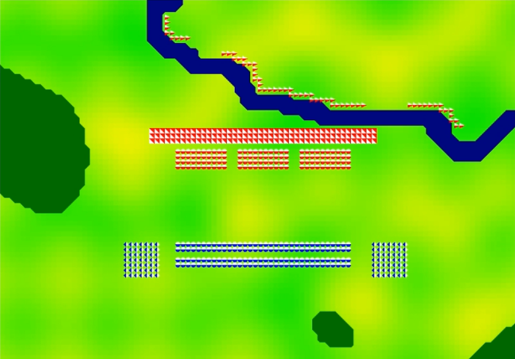
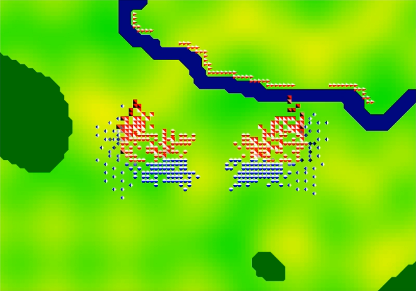
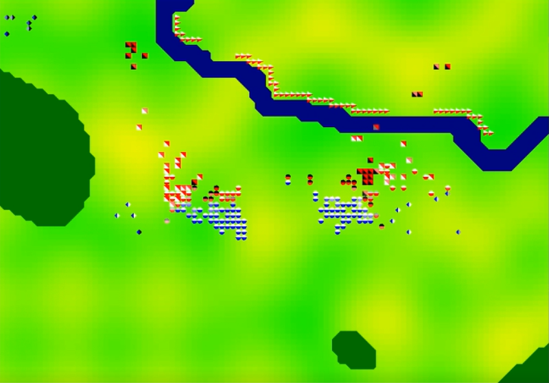

# BattleSimulation
Battle Simulation Report

Performed by: Mikołaj Kardyś Dominik Sulik

The task of the model is to simulate a medieval battle using an agent simulation. Two teams participate in the battle and it ends when all members of one of them disappear from the board (by death or escape).

In the simulation, the distance is always calculated in a Cartesian way (the root of the sum of squares differ in coordinates). Simulation Action: In each iteration of the simulation, we perform the following operations for all agents (in random order):

We check by our action points whether we can make a move in this turn (whether their value is less than 1); if not, subtract 1 and wait;
If we can perform the action, we start by calculating our current morale: For all the blows received from the previous action, we get a minus to morale equal to:
For each visible ally at a distance of max. 3 we get a bonus to morale equal to: wartość_jednostki / distance. For each visible opponent at a distance of max. 3 we get a minus to morale equal to: wartość_jednostki / distance.
Then, depending on the ownership of the unit and the morale parameter, we choose one of the available actions: 0)MOVE – this action can only be performed as a result of the ESCAPE or ATTACK action. It consists in moving to the given field, for the appropriate cost of action points.* 1)ATTACK – we start by choosing a target depending on the following criteria: It is close to us: the power of the criterion: 1 / distance The retort – attacked us from our last action; criterion power: 4 Its service life is lower than ours; criterion power: 2 Since his last action, he has been attacked by other members of our team (number of attacks: ); criterion power: The target in the set of opponents will be the one for whom the value of the product of these criteria is the highest.
If no enemy is within our range, we choose the target from a set of all visible enemies and perform the MOVE action on the field closest to it;
If there are enemies within our range, we choose the target from their collection. After the blow, * we get a number of morale points equal to the parameter wartość_jednostki this unit. If the opponent dies from this blow, we get the second as much.
2) ESCAPE – we consider all fields in our immediate vicinity. For each of them, we count its average distance from all our visible opponents. We choose the one that is the farthest away and perform the MOVEMENT action on this place. If we are directly on the edge of the board, we set the escapes flag to true; in the next iteration of the simulation we will be removed from the board. Note: If it is not possible to perform this action, and we want to perform it, then if there are enemies in our immediate vicinity, by default we will try to perform the ATTACK action. Otherwise, we will perform the WAITING action. 3) WAITING – we do not perform any of the above actions. I renew 10% of my health points and stay with the same amount of action points.

Unit types:

Unit types are based on the types of soldiers taking part in battles around the Battle of Hastings (1066).

1) Infantry Light troops fighting in hand. They were not professional soldiers, so their arsenal and usefulness on the battlefield were very limited.

Additional behavior: none

Interaction with other units: Due to low level of training and poor armament, units of this type will be weak against all other melee units.

Terrain interaction: Light armament makes it easy to get around. Units of this type receive a bonus for action in ordinary terrain and average penalties in the forest and in the river.

2) Heavy infantry Units modeled on the troops of Anglo-Saxon huskrills, dressed in heavy chain mail and armed with spears, short weapons (usually an ax, less often a sword) and a large shield, and sometimes also long Danish axes.

Additional behavior: FORMATION – units of this type in our simulation will move differently than ordinary infantry. Agents of this type will put more emphasis on holding the formation in the first stage of the clash, simulating the behavior of the formation called the Wall of Shields.

Interaction with other units: Good training, armament and discipline give them a high bonus to fight light infantry and cavalry. The slower rate of movement, both by loading and moving in formation, makes them weak against archers.

Terrain interaction: The weight of the armament means that in the open area and in the forest, units of this type receive slightly higher penalties than ordinary infantry. However, this affects the shares in the river the worst, giving them a very high penalty.

3) Cavalry At the turn of the first and second millennium, cavalry slowly began to take shape in knights in plate armor known to us from the end of the era. During this period, however, heavy cavalry was still not a constant sight on the battlefield. Both in the Byzantine and Norman armies there were light mounted units, performing mainly reconnaissance functions.

Additional behavior: LOOSE ARRAY – units of this type will try to keep a small distance from other allies, which makes it easier for them to maintain the ability to maneuver CONTROLLED RETREAT – due to the dominant speed of this type of troops on the battlefield, they did not have to be too afraid of chasing from other types of units. So they will gradually regain morale if they are far enough away from the enemy when trying to escape.

Interakcja z innymi jednostkami: Uzbrojenie i wyszkolenie dają tym oddziałom przewagę nad zwykłą piechotą, a szybkość poruszania się i luźna formacja – przeciwko łucznikom. Mimo to, w zwarciu nie będą tak skuteczni jak ciężka piechota, otrzymują więc karę przy starciu z nią.

Interakcja z terenem: Poruszanie się na grzbiecie konia zapewnia tym jednostkom najwyższą ze wszystkich skuteczność poruszania się po otwartym terenie, jak i pozwala najłatwiej pokonywać rzekę. Stanowi ono jednak przeszkodę przy poruszaniu się po lesie, dając wysoką karę w tym obszarze.

4)Łucznicy Łucznicy byli popularnym typem jednostki na polu bitwy od starożytności. Podczas inwazji Anglii normańscy łucznicy stanowili ważną część armii Wilhelma Zdobywcy. Będzie to jedyna w naszej symulacji jednostka walcząca na dystans, co pozwoli jej na dosięgnięcie przeciwników zanim ci będą mogli zadać jej szkodę.

Dodatkowe zachowanie: TRZYMAJ POZYCJĘ – jednostki tego typu nie będą szarżować tak jak pozostałe, zachowując energię, aby móc zaatakować wroga kiedy tylko wejdzie w ich zasięg. KROK W TYŁ – łucznicy będą za wszelką cenę unikali walki wręcz, wykonując jednorazowo akcję UCIECZKA, jeśli przeciwnik podejdzie zbyt blisko, dając szansę na to, aby dosięgnęły go ataki reszty sojuszników. Gdy w zasięgu nie będzie już więcej przeciwników, jednostka wróci na swoje miejsce.

Interakcja z innymi jednostkami: Jednostki tego typu otrzymują bonus do walki z ciężką piechotą ze względu na jej niskie tempo poruszania się, ale z tego samego powodu otrzymują też karę do walki z kawalerią.

Interakcja z terenem: Lekkie uzbrojenie daje tym jednostkom takie same możliwości poruszania się, jakie ma lekka piechota. Jednak z uwagi na sposób ataku, jednostki tego typu jako jedyne otrzymują dodatkowy minus do jego siły przy walce w lesie.

Generowanie terenu Do wygenerowania terenu użyliśmy następujących algorytmów: 1)Algorytm marching squares 2)Perlin noise 3)Algorytm Bresenhama 4)Algorytm A*

1.Wysokość terenu nad poziomem morza Każda komórka na mapie posiada parametr altitude, który określa wysokość tego punkt nad poziomem morza. Do wygenerowania tej cechy wykorzystaliśmy szum Perlina. Dla każdej komórki o współrzędnych x i y wartość altitude = noise(xterrainFrequency, yterrainFrequency), gdzie terrainFrequency jest liczbą z zakresu (0;1). Wysokość terenu wpływa na szybkość poruszania się wszystkich jednostek. Tempo ruchu spada gdy jednostka idzie pod górę oraz rośnie gdy jednostka schodzi w dół.

2.Las Dla każdego z punktów węzłowych komórek na mapie wygenerowaliśmy szum Perlina jw. (z inną wartością częstotliwości - forestFrequency). Następnie wszystkie wygenerowane wartości sprawdziliśmy warunkiem noise >= sparseForestThresh, tym punktom dla których warunek okazał się prawdziwy przypisaliśmy wartość 1, pozostałym 0. Otrzymaną siatkę wartości binarnych potraktowaliśmy algorytmem marching squares. W wyniku tej operacji otrzymaliśmy struktury przypominające las, który tym samym algorytmem podzieliliśmy na las gęsty (denseForestThresh) i las rzadki.

3.Rzeka Dla każdego z punktów węzłowych komórek na mapie wygenerowaliśmy szum Perlina, który następnie poddaliśmy binaryzacji progowej jw. (odpowiednio z obstaclesFrequency i obstaclesThresh). Następnie wylosowaliśmy dwa punkty na granicach mapy. Ostatnim krokiem było zastosowanie algorytmu A*, który znalazł najkrótszą (o ile istnieje) ścieżkę pomiędzy punktami na brzegach mapy. Tak powstała ścieżka to rzeka.

4.Widoczność Do poruszania się jednostek niezbędna jest funkcja odpowiedzialna za określanie czy z danego punktu na mapie widać inny punkt.

Do zaimplementowania tej metody użyliśmy algorytmu Bresenhama (służącego do wyznaczania komórek pomiędzy dwoma pozycjami na siatce). Dla tak wyznaczonych punktów obliczyliśmy następującą wartość visibility (zainicjalizowaną na zero):

jeśli punkt znajduje się w gęstym lesie wówczas odejmij od visibility 2
jeśli punkt znajduje się w rzadkim lesie wówczas odejmij od visibility 1
w przeciwnym wypadku nie odejmuj od sumy Następnie w zależności od położenia jednostki która obserwuje daną lokację oraz otrzymanej sumy określiliśmy widoczność punktu: jeśli jednostka znajduje się w lesie rzadki, a obserwowana przez nią pozycja na łące, wówczas próg (fromForestVisibility) odpowiedzialny za dostrzeżenie pola jest średni, jeśli jednostka znajduje się na łące, a obserwowana przez nią pozycja w lesie, wówczas próg (toForestVisibility) odpowiedzialny za dostrzeżenie pola jest wysoki, w pozostałych przypadkach próg (throughForestVisibility) widoczności jest niski
Symulacja Przeprowadziliśmy symulację bitwy dla wylosowanego terenu oraz z takim rozkładem jednostek: image image image

After a dozen or so seconds, the situation on the battlefield is as follows:

In the battle simulated by us, the Reds won.

Development opportunities 
1)adding more units from the historical period we are considering 
2)selecting more accurate unit parameters using an evolutionary algorithm 
3)introducing a command layer in which units are given top-down orders based on the situation on the entire battlefield and thanks to which units are assigned to appropriate units 
4)differentiation of terrain types

